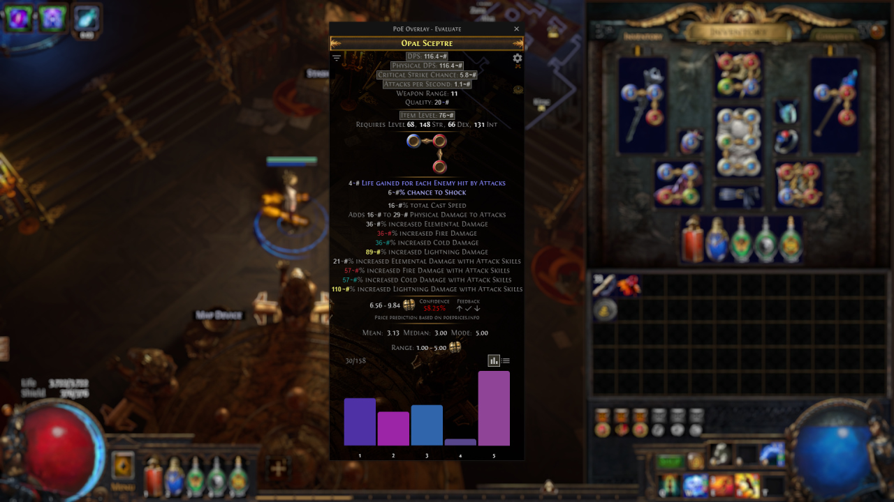
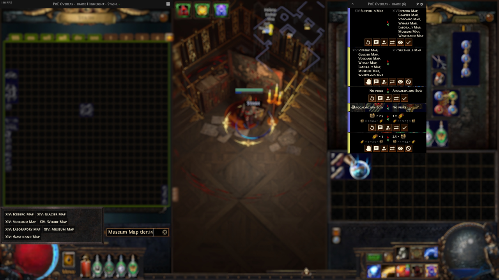
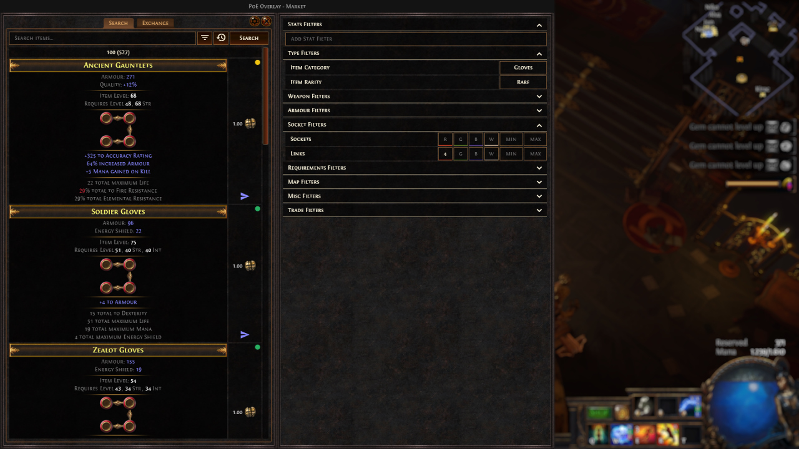
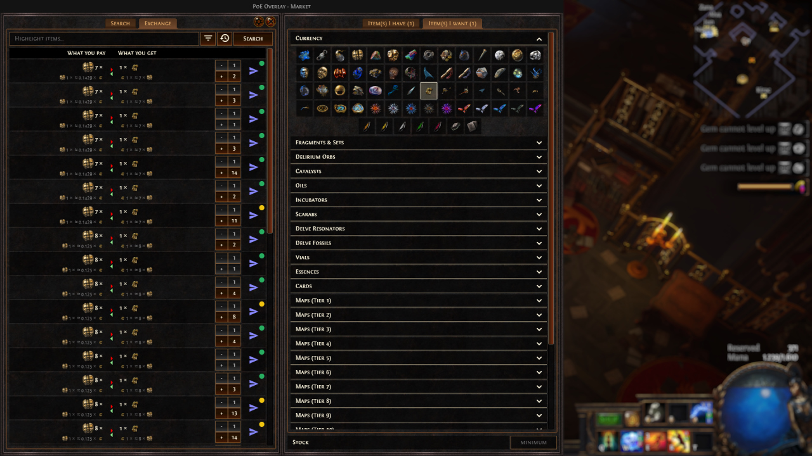
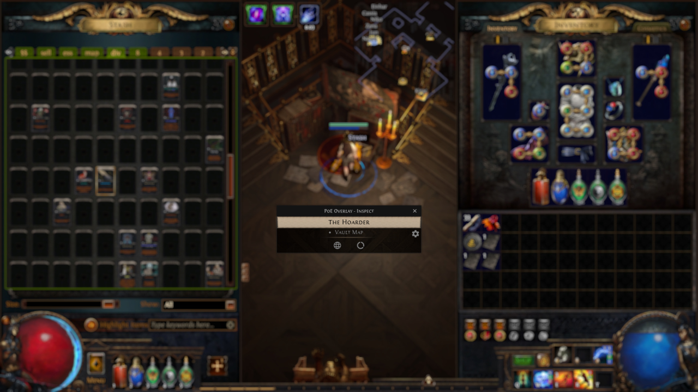
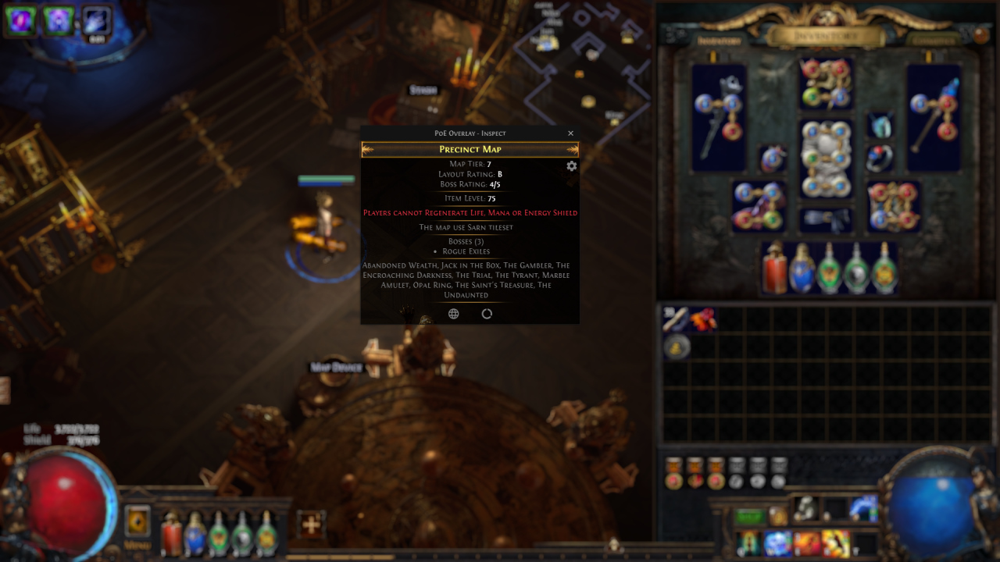
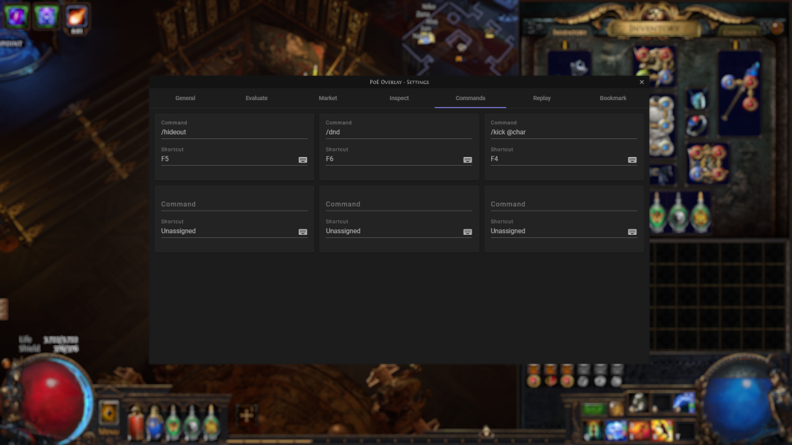
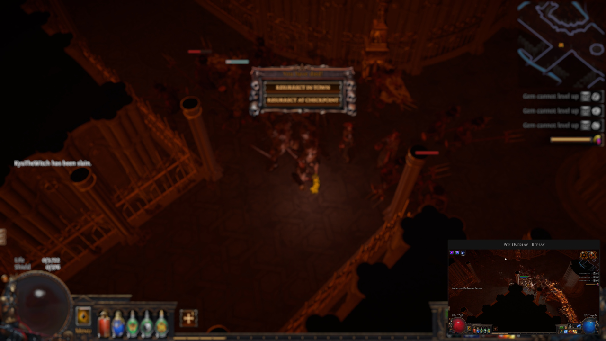
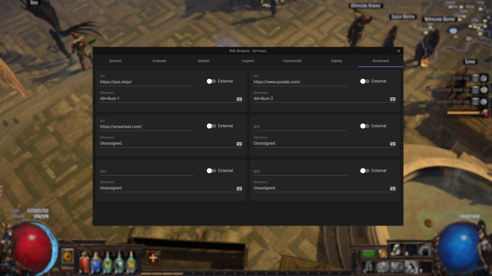

## Features

### Evaluate

Quickly evaluate your items. Properties can be added and removed from the query with a simple click. Values can be adjusted with scrolling. Clicking a listing will then copy a formatted note.

### Trade

Manage incoming and outgoing trade requests by sending messages, inviting players and initiating trades via simple clicks.

### Market

Filter the listings to find your perfect item on the market and finally request the item with a single click.

Also supports bulk exchange for e.g. currencies or maps.

### Inspect

Items can be inspected to gather helpful insights. For most items you can get the drop location and you can always open the item in the official wiki or poe.db for detailed information.

For maps you will see dangerous stats, community ratings and the actual bosses and last but not least the loot.

### Commands

In-game commands can be bound to hotkeys for a quick execution - with placeholder support. For example @char will be replaced with the current name of your character.

### Replay

Lets you rewatch the last highlight of your session. A highlight can be a significant boss kill or your player death.

### Bookmarks

Bind useful websites to hotkeys and visit them while playing without leaving the game.

