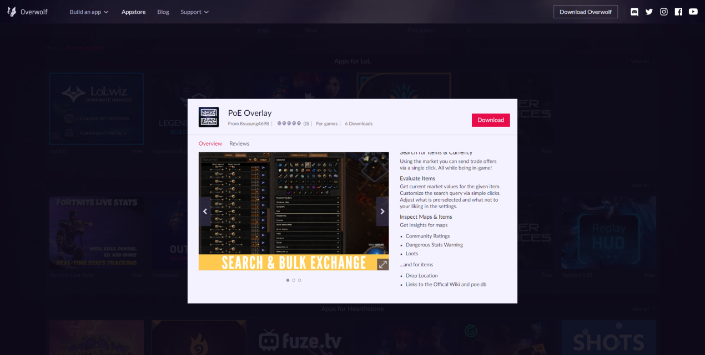
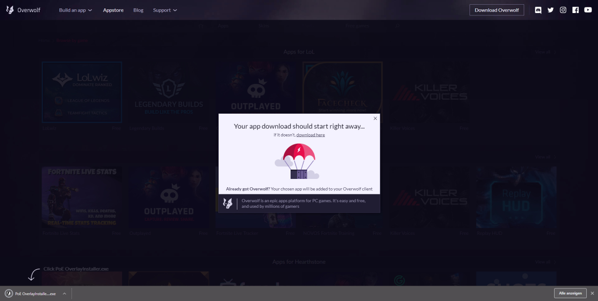
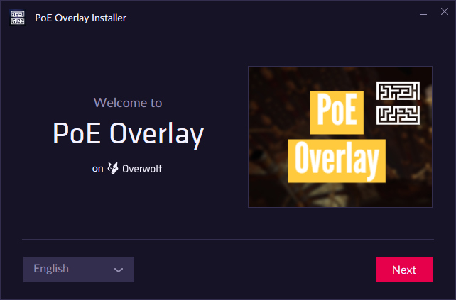
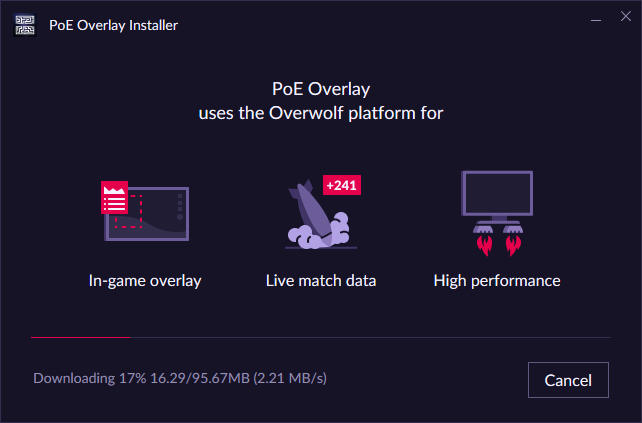
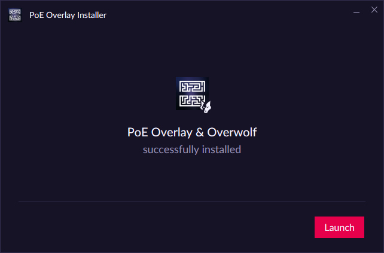
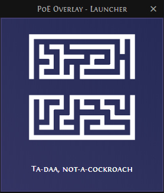

# Installing
1. [Visit the Overwolf Store](https://www.overwolf.com/app/Kyusung4698-PoE_Overlay) and click on download. 
2. Run the downloaded installer.  
3. Select your language and follow the installer instructions.  

4. The installer should now download all required files. This may take a few seconds. 
5. Once everything is finished you can launch PoE Overlay.  
6. Unless PoE is running you should now see following launcher.   
7. Once PoE is launched you will be greeted with a interactive guide through the basic functionality.  
