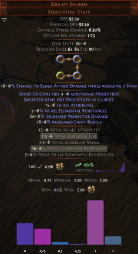
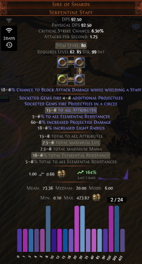
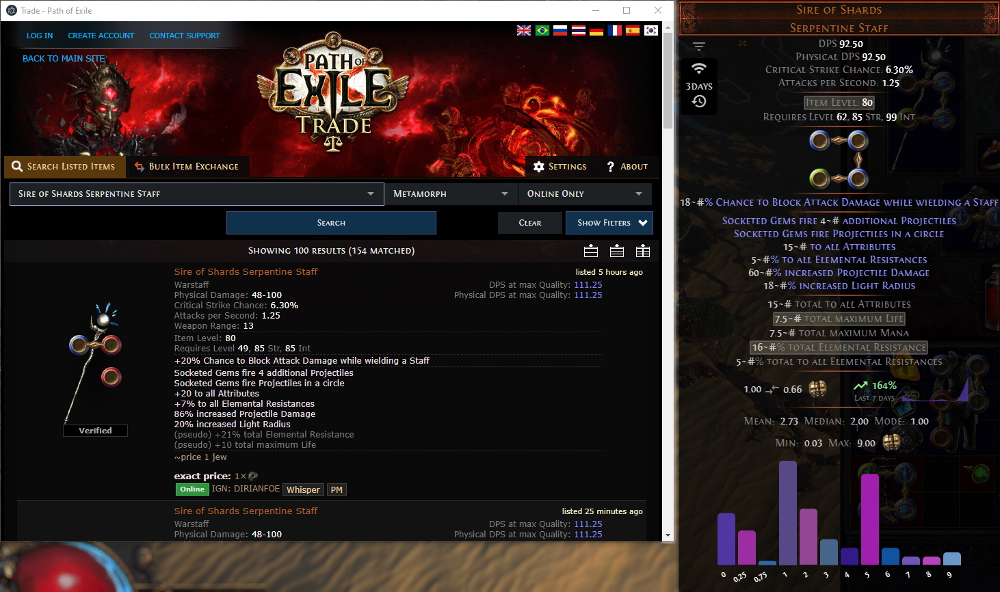
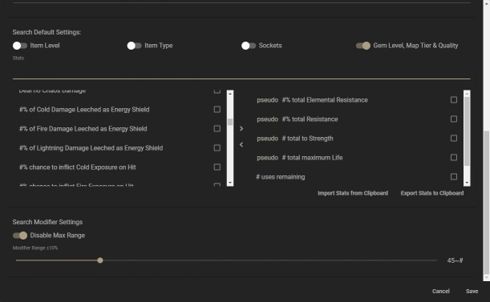

# PoE Overlay 0.5.19

An Overlay for Path of Exile. The ***core aspect*** is to blend in with the game. Built with Electron and Angular. 
 
<!-- TOC -->
- [Status](#status)
- [Features](#features)
- [Roadmap](#roadmap)
- [Enduser](#enduser)
    - [Getting Started](#getting-started)
        - [Prerequisites](#prerequisites)
        - [Installing](#installing)
        - [Shortcuts](#shortcuts)
- [Developer](#developer)
    - [Getting Started](#getting-started-1)
        - [Prerequisites](#prerequisites-1)
        - [Installing](#installing-1)
    - [Running the tests](#running-the-tests)
        - [And coding style tests](#and-coding-style-tests)
    - [Building](#building)
    - [Built With](#built-with)
    - [Contributing](#contributing)
    - [Versioning](#versioning)
- [Authors](#authors)
- [License](#license)
- [Acknowledgments](#acknowledgments)
<!-- /TOC -->

## Status

This project is currently in a ***pilot phase***. If you encounter any bugs or have feature requests please open up an issue on github. 

## Features

[](https://www.youtube.com/watch?v=_cJmW8QkQnM)

* Evaluation of items:
    * select your preferred currencies and language
    * uses the official pathofexile.com/trade website
    * a graphical display of the price distribution<br> 
    * filter your search on all supported properties on click<br> 
    * an in game browser to display the created search<br> 
    * lets you price tag the item by clicking the desired bar/value

* Customisable keybindings:  
    * bind in game commands to a custom hotkey
    * premade /hideout on `F5` and /dnd on `F6`

* Misc:
    * Navigating storage by CTRL + WHEEL
    * Highlighting items by ALT + F

* Menu:
    * an in game menu to change all settings<br> 

## Roadmap

| Module        | Status        | Notes   |
| ------------- |-------------: | ------- |
| Core | 100% | + overlay<br>+ global shortcuts<br>+ user settings (language, league)<br>+ custom shortcuts<br>+ ~~auto updating~~ version check
| Shared | 100% | + item frame<br>+ currency frame<br>+ item parser in all languages<br>+ item parser mods
| Evaluate         | 100%           | + Basic search implemented <br>+ User settings (display currency, translated language) <br>+ Chart to display values instead of avg <br>+ Advanced search with filter on modifiers |
| Command        | 100%            | + bind in-game commmands to shortcuts (/dnd, /hideout) |
| Map        | 100%            | + display map info (layout, bosses, ...)<br>+ customisable mod warnings |
| Misc        | 100%            | + navigating through storage by CTRL + WHEEL<br> + highlighting items by ALT + F |
| Trade      | 0%           | - Send messages<br>- Trade UI<br>- etc.       |


## Enduser

### Getting Started

These instructions will set you up to run and enjoy the overlay.

#### Prerequisites

* Path of Exile ***must be*** in windowed fullscreen mode
* PoE Overlay should run with privileged rights

#### Installing

1. Head over to [Releases](https://github.com/Kyusung4698/PoE-Overlay/releases) and download the latest zip
2. Extract zip
3. Run `poe-overlay 0.5.19.exe`
4. Start Path of Exile
5. Wait until you can see `PoE Overlay 0.5.19` in the bottom left corner
6. Hit `f7` and set `Language` and `League` to meet your game settings

#### Shortcuts

You can change these shortcuts in the user settings menu.

|Shortcut        |Description
|---             |---	    
| `ctrl+d`       | Displays the item in a frame and evaluates the price. You can open the offical trade site on click of the currency value
| `ctrl+t`       | As above - displays the item translated
| `alt+w`        | Opens item in wiki
| `ctrl+alt+w`   | As above - but in external browser
| `alt+g`        | Opens item in poedb
| `ctrl+alt+g`   | As above - but in external browser
| `alt+q`        | Shows map info (layout, bosses)
| `ctrl+f`       | Highlights item in stash
| `ctrl+wheel`   | Navigates through stash tabs
| `f5`           | Go to Hideout
| `f6`           | Toggle DND
| `f7`           | Opens the user settings menu
| `f8`           | Exits overlay

## Developer

### Getting Started

These instructions will get you a copy of the project up and running on your local machine for development and testing purposes.

#### Prerequisites

Your editor of choice for a node project - like [vscode](https://code.visualstudio.com/).

The first thing to install is [nodejs](https://nodejs.org/en/). Download your matching executable and follow the instructions.

Then you need to install the [windows-build-tools](https://github.com/felixrieseberg/windows-build-tools) from an elevated PowerShell or CMD.exe. This may take a while (10-15min).
```
npm install --global --production windows-build-tools
```

#### Installing

1. Clone the repository. 
2. Open up the folder with your editor.
3. Run ```npm install``` to install all required npm packages.
4. Run ```npm run electron:rebuild``` to generate a executable [robotjs](https://github.com/octalmage/robotjs) version.

That's it. Your Project should now be ready to run:
```
npm run start
```

### Running the tests

These are used to test for eg. the external APIs (poe.ninja, etc.). To run those:
```
npm run ng:test
```

#### And coding style tests

These will run certain linters to keep the project in a clean state.

```
npm run ng:lint
```

### Building

A electron executable can be generate by calling:
```
npm run electron:windows
```

### Built With

* [Electron](https://electronjs.org/) - The desktop app framework
* [Angular](https://angular.io/) - A component framework

### Contributing

Please read [CONTRIBUTING.md](CONTRIBUTING.md) for details on our code of conduct, and the process for submitting pull requests to us.

### Versioning

We use [SemVer](http://semver.org/) for versioning. For the versions available, see the [tags on this repository](https://github.com/Kyusung4698/PoE-Overlay/tags). 

## Authors

* **Nicklas Ronge** - *Initial work* - [Kyusung4698](https://github.com/Kyusung4698)

See also the list of [contributors](https://github.com/Kyusung4698/PoE-Overlay/contributors) who participated in this project.

## License

This project is licensed under the MIT License - see the [LICENSE.md](LICENSE.md) file for details

## Acknowledgments

* [Grinding Gear Games](https://www.pathofexile.com/) the game
* [PoE TradeMacro](https://github.com/PoE-TradeMacro/POE-TradeMacro) initial inspiration
* [poe.ninja](https://poe.ninja/) currency values
* [libggpk](https://github.com/MuxaJIbI4/libggpk) parsing content.ggpk
