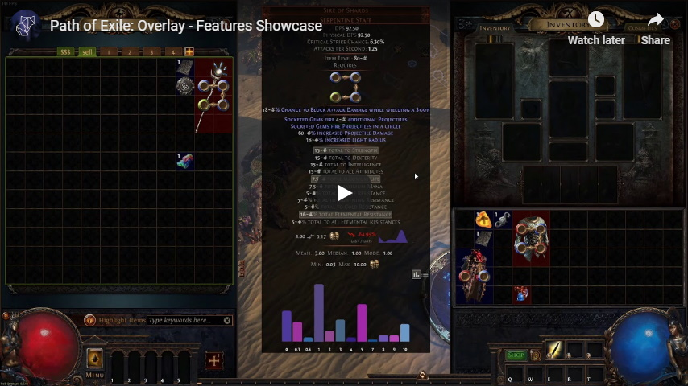

# PoE Overlay

PoE Overlay lets you search the market and request items and helps you to evaluate the price of your items. As well as getting insights for your maps before running them and allows you to rewatch important game events like your player death.

It also offers a seamless integrated user interface with **all client languages** available.

## ✨ Features

A overview of all features can be found [here](FEATURES.md).

## 🚩 Installing

1. Download the new version from the [Overwolf Store](https://www.overwolf.com/app/Kyusung4698-PoE_Overlay)
2. Run the downloaded installer

The complete guide with pictures can be found [here](INSTALLING.md).

## ⭐ Roadmap

| Module        | Feature         | Status | Note     
| ------------- | --------------- | ------ | ---------
| Market        | Save Queries    | 📚     |
| Market        | Sort Results    | 📚     |
| Stash         | Filter Category | 📚     |

🚧 In Progress 📚 Backlog ⚡ Blocked 🐺 Overwolf 

### 🚀 You want to request a feature?

Great! Just click on [create a issue](https://github.com/Kyusung4698/PoE-Overlay/issues/new/choose) and choose the feature request template.

### 🐞 You want to submit a bug?

Click on [create a issue](https://github.com/Kyusung4698/PoE-Overlay/issues/new/choose) and choose the bug template.

### 📰 You want to know what's new?

View the changelog of this application [here](CHANGELOG.md).

## 🔥 Acknowledgments

- [Grinding Gear Games](https://www.pathofexile.com/) - PoE
- [Overwolf](https://www.overwolf.com/pages/homepage/) - Overlay Platform
- [poe.ninja](https://poe.ninja/) - Market Statistics
- [poeprices.info](https://www.poeprices.info/) - Item Price Prediction
- [libggpk](https://github.com/MuxaJIbI4/libggpk) - Parsing PoE Data
